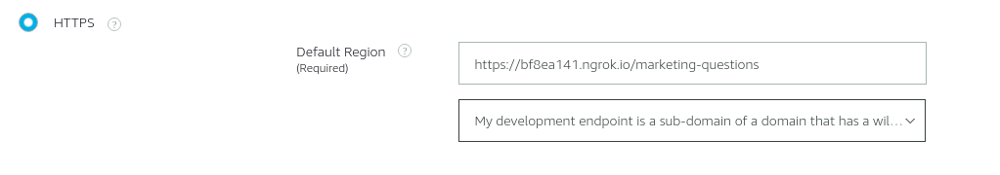

## Hot to use ngrok for alexa skill testing


Alexa nei suoi skill intent invoca dei servizi http in post, necessita però di lavorare sempre in https, per poter testare in locale le chiamate verso i propri servizi è possibile utilizzare ngrok nella seguente modalità:

```bash
ngrok http -bind-tls=true -host-header=rewrite 8080
```


**Notes:**

Nell'endpoint della skill alexa deve essere selezionata la seguente option:


